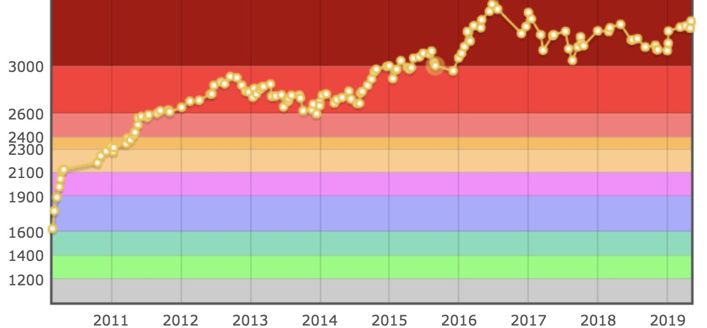

Pendant cette série d'articles, vous allez apprendre l'importance de l'algorithmique et des compétitions de programmation (voir plus).

**Part1** : L’importance des algorithmes / competitive programming   
**Part2** : Comment comprendre l’énoncé ?   
**Part3** : Comment trouver une solution ?   
**Part4** : Planifier une approche   
**Part5** : Exemple d’un problème populaire d’optimisation combinatoire 

## Introduction aux compétitions de programmation

Les **compétitions de programmation** sont un sport intellectuel où les candidats doivent résoudre le plus de problèmes d'algorithmie possible en un **minimum de temps**.
Les candidats doivent faire preuve de logique pour venir à bout des problèmes posés. Ils doivent également avoir une bonne connaissance des structure de données, d'un langage de programmation (à savoir que maintenant, bon nombre de langages sont autorisés et supportés dans les compétitions) et une bonne technique d'implémentation des problèmes.   

Généralement un cash price et des lots sont mis en jeu pour les meilleurs développeurs. C'est également un moyen de se confronter à d'autres codeurs et de progresser pour d'éventuels entretiens où les questions techniques peuvent être du même style que celles posées lors des concours.   

Enfin, la plupart des plateformes en ligne proposent un système de ranking, où l'on peut directement voir son évolution au cours du temps, ce qui me semble être un moyen stimulant de progresser.

**Liste de ressources pour s’entrainer** : Codeforces, TopCoder, Google Code Jam, CodeChef, HackerRank,…
Ces sites proposent de bons problèmes pour s’entraîner avec un système de jugement automatique.
De plus, une grande variété de langages de programmation sont disponibles !

**Liste des compétitions les plus connues** : Google Code Jam, TopCoder, Facebook Hacker Cup

**Liste de ressources** : https://github.com/lnishan/awesome-competitive-programming

**Source dont je me suis inspiré pour écrire ces lignes** https://www.topcoder.com/community/competitive-programming/tutorials/

**Pourquoi participer à ces compétitions ?**

Ces compétitions sont un bon moyen d'apprendre:   
- des algorithmes / raisonnements logiques utiles 
- à coder et débugger **rapidement** et **efficacement**   
- à améliorer vos compétences d'analyse
- à gérer la notion de temps / stresse   
- à découper et organiser efficacement son travail  
- à se confronter à d'autres développeurs (français ou non)

## Introduction à l'algorithmie

Pour commencer, **« Qu’est-ce qu’un algorithme ? »**. Si on s’en tient à la définition nous avons :
«  Un algorithme est une **procédure de calcul** qui prend une valeur ou un ensemble de valeurs en entrée et génère une valeur ou un ensemble de valeurs en sortie. »
Autrement dit, un algorithme est en quelque sorte une **fiche de route** qui nous permet d’accomplir une mission définie.   
Même une fonction simple qui calcul la somme de deux entiers est un algorithme dans un certain sens. 

Vous serez peut-être surpris d'apprendre combien d'algorithmes complexes sont utilisés quotidiennement par les utilisateurs lorsqu'ils vérifient leur courrier électronique ou écoutent de la musique sur leur ordinateur. Cette série de workshops présentera quelques idées de base relatives à l'analyse d'algorithmes, puis les mettra en pratique avec quelques exemples illustrant pourquoi il est important de connaître la logique derrière ces algorithmes.

Si vous travailler dans le développement logiciel / web, vous devrez probablement être en mesure d’évaluer à quel vitesse votre code s’exécutera.   
De plus, vous devrez aussi comprendre le détail des algorithmes appliqués afin de pouvoir prédire si il existe des cas particuliers dans lesquels votre code sera lent ou produira des erreurs.

**Voici globalement les étapes à suivre:**

- 1 - Lire l’énoncé (problème - input/output - limite de temps / mémoire)
- 2 - Rendre le problème abstrait
- 3 - Designer un algorithme
- 4 - Implémenter et débugger
- 5 - Soumettre votre code
- 6 - Résultat (Si réponse fausse, retourner à l’étape 4)

(NOTE: idéalement les étapes 2 et 3 se font sur papier).

**Analyse du temps d’exécution**

Un des problèmes majeur dans l’analyse des algorithmes sont les performances. 
Autrement dit, comment minimiser le temps d’exécution de notre programme mais aussi la mémoire qu’il consomme.   
Généralement dans les compétitions de programmation, des contraintes de temps et de mémoire sont fixés à chaque début de problème pour forcer les 
participants à trouver les solutions les plus optimales possible.

Habituellement, pour chaque problème, il y a au minimum 2 jeux de tests différents (un petit et un plus important). 
Il est donc important d’analyser la taille des input pour choisir une solution en adéquation avec ce qu’il vous ai demandé de faire.   
Si vous voulez réussir à résoudre le problème, votre programme devra passer les différents jeux de tests pour avoir une réponse positive du juge.   
Autrement vous aurez des erreur MLE (memory limit exceed) ou  TLE (time limit exceed).
Autre point important, pour chaque réponse non correcte vous aurez des pénalités (sous forme de temps ou points).

**Big 0**

Un des aspect important de la bonne construction d'un algorithme est son temps d'exécution. Autrement dit, comment l'algorithme se comporte lorsque celui-ci est exécuté avec des paramètres d'entrée plus importants.   
Voici une approximation du temps de traitement en fonction de la complexité de l’algorithme choisit:

| Complexité  | Temps d'exécution |
| ----------- | ----------------- |
| O(Log(N))   | 10-7 secondes     |
| O(N)        | 10-6 secondes     |
| O(N*Log(N)) | 10-5 secondes     |
| O(N2)       | 10-4 secondes     |
| O(N6)       | 3 minutes         |
| O(2N)       | 1014 ans          |
| O(N!)       | 10142 ans         |

(Avec N = 100)

Notion importantes abordées dans ces ateliers:

	- Data structures
	- Dynamic programming
	- Graph algorithms
	- Geometric algorithms
	- String algorithms
