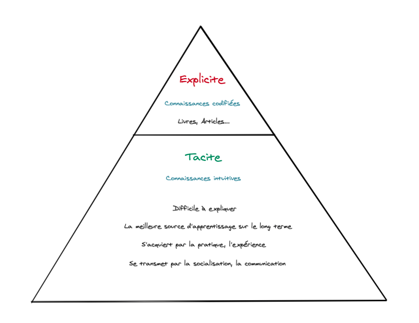

Il y a quelques jours je suis tombé sur un post de [Sebastien Lorber](https://www.linkedin.com/posts/sebastienlorber_reactjs-javascript-dev-activity-6684382090517090304-sOlS) qui présentait le livre de Shawn Wang, « The Coding Career Handbook ».

J’ai tout de suite voulu en savoir plus sur ce livre qui traitait d’un sujet qui m’intéresse tout particulièrement, et qui aborde une méthode d’apprentissage, le « Learn in Public ».

Je pense réaliser une série d’articles au fil de la lecture de ce livre pour vous partager des points qui me semblent intéressants et souvent peu abordés dans l’univers tech.

Aujourd’hui nous allons parler des connaissances tacites et pourquoi il est important d’en prendre conscience. Je me suis inspiré de l’article de Cedric Chin [Why Tacit Knowledge is More Important Than Deliberate Practice](https://commoncog.com/blog/tacit-knowledge-is-a-real-thing/). Je vous invite à aller le lire, il aborde en détails les notions que nous allons voir ensemble.

Mais tout d’abord…

## Qu’est-ce que la connaissance tacite ?

Comme le dit très bien Shawn, **on peut lire tous les livres de programmations du monde, on reste limité à ce que les personnes peuvent mettre par écrit**. Autrement dit, il est difficile de codifié des ressentis, des choses qui nous sembles innées ou intuitives.

Si on prend la définition Wikipedia on nous dit que : *« Les connaissances tacites regroupent les compétences innées ou acquises, le savoir-faire et l'expérience. Elles sont généralement difficiles à « formaliser » par opposition aux connaissances explicites. »*

L’ensemble des connaissances que vous pouvez apprendre dans des livres ou autre ne représente que la **partie émergée de l’iceberg** : 

Je vais reprendre l’analogie de Cedric Chin avec **l’apprentissage du vélo**. 
Essayez d’expliquer à un enfant comment faire du vélo, simplement avec des mots. Vous pourrez toujours lui expliquer comment vous faites, avec toutes les meilleures explications du monde, au moment où il montera sur le vélo, il y a de fortes chances qu’il tombe…   

Et si jamais il y arrive, prenez un peu recul… A t-il réussi grâce à vos instructions ou parce qu’il avait des prédispositions pour faire du vélo ?
(Je vous recommande fortement de lire cet article https://andymatuschak.org/books/)

La méthode qui serait la plus **appropriée** pour lui d’apprendre le vélo serait d’avancer étape par étape: 

- Commencer en choisissant un vélo avec lequel il peut avoir les **pieds qui touchent le sol** en cas de chute
- Lui faire comprendre **l’équilibre** en parcourant de petites distances en s’aidant des pieds
- Puis **rallonger la distance**
- Et enfin, lorsqu’il aura trouvé l’équilibre, il pourra commencer à **pédaler**

Cette façon d’aborder l’apprentissage par l’émulation et l’action permettra à l’enfant de comprendre et de ressentir par lui même la bonne méthode à suivre.
Selon Cedric Chin qui explique lui-même cette histoire, il ne fallait pas plus d’une heure pour voir l’enfant passer d’une incompétence consciente à une compétence consciente puis à une compétence inconsciente.

Je vous vois venir en me demandant « Ça fonctionne pour les choses physiques mais quant est-il des choses intellectuels ? ».   
Les connaissances tacites sont partout autour de nous. Selon le chercheur Samo Burja, elles sont une sorte de « matière noire intellectuelle » faisant partie de la société dans des million de manière différentes. Nous pouvons la retrouver par exemple dans la résolution de problème…

Il explique aussi que la propagation des connaissances tacites a explosé avec l’arrivée de YouTube et des nouveaux moyens de partage de l’information. Avant, la transmission devait se faire en personne pour que l’apprentie puisse scrupuleusement observer le maitre et apprendre en temps réel.

**Maintenant, essayons de faire le pont avec notre métier...**

Il y a quelques mois, nous avons décidé avec l’équipe dans laquelle je travaille de mettre en place des séances de pair-mob programming (1-4 sur le même ordinateur).
C’était l’occasion pour moi de travailler d’une manière différente et de partager mes connaissance mais aussi de m’adapter à la façon de travailler de mes collègues.   

C’est le moment où je me suis rendu compte que certaines choses que mes collègues avait pour acquis ne l’était pas forcément pour moi.
Et au moment de demander certaines explications, les réponses n’étaient pas très claires et menaient souvent au même endroit « quand tu as X tu dois faire Y. Mais quand il y a Z tu dois faire U…».

Le problème ici n’était pas que mes collègues ne pouvaient pas m’expliquer ces concepts mais que leurs explications n’allait pas m’amener aux mêmes connaissances qu’ils avaient.

## Mais finalement comment apprendre les connaissances tacites ?

La première chose qu’on pourrait se dire c’est que nous allons apprendre ses connaissances en pratiquant délibérément...   
Mais ce n’est pas la méthode à suivre, le processus d’apprentissage ressemble un peu plus à quelque chose comme ça:
- Trouver un mentor, une personne qui pourra vous transmettre ses connaissances
- Vous travaillez avec lui pendant un certain temps
- Vous apprenez en osmose avec lui, en l’imitant et en écoutant ces conseils-retours
